# SmartNote 📝

A modern, full-stack note-taking and task management application built with **Spring Boot** and **React TypeScript**. SmartNote provides real-time collaboration, intelligent organization, and seamless task tracking to boost your productivity.

[](https://opensource.org/licenses/MIT)
[](https://www.oracle.com/java/)
[](https://spring.io/projects/spring-boot)
[](https://reactjs.org/)
[](https://www.typescriptlang.org/)

## ✨ Features

- **📄 Rich Note Editor**: Create and edit notes with rich text formatting and auto-save every 5 seconds
- **🔍 Advanced Search**: Full-text search across all notes with intelligent filtering
- **📅 Calendar Integration**: Manage events and deadlines with an intuitive calendar view
- **✅ Task Management**: Prioritize tasks by level and deadline with a smart to-do list
- **👥 Real-Time Collaboration**: Share notes and collaborate with multiple users via WebSocket
- **💬 Live Chat**: Built-in chat functionality for seamless team communication
- **🔔 Smart Notifications**: Kafka-powered real-time notifications for updates and invitations
- **📊 Analytics Dashboard**: Visualize task statistics and productivity metrics
- **🔐 Secure Authentication**: JWT-based authentication with email integration

## 🚀 Quick Start

### Prerequisites

Ensure you have the following installed:

| Tool | Version | Purpose |
|------|---------|---------|
| [Docker](https://www.docker.com/get-started) | Latest | Containerization |
| [Docker Compose](https://docs.docker.com/compose/install/) | Latest | Multi-container orchestration |
| [Git](https://git-scm.com/) | Latest | Version control |
| [JDK](https://www.oracle.com/java/technologies/javase-jdk17-downloads.html) | 17+ | Backend runtime (optional for manual setup) |
| [Node.js](https://nodejs.org/) | 18+ | Frontend runtime (optional for manual setup) |

### Installation

1. **Clone the repository**
   ```bash
   git clone https://github.com/hoangtuan203/Project-SmartNote.git
   cd Project-SmartNote
   ```

2. **Configure environment variables** (Optional)
   
   Create a `.env` file in the root directory:
   ```env
   # Backend Configuration
   BACKEND_PORT=8080
   SPRING_DATASOURCE_URL=jdbc:postgresql://db:5432/smartnote
   SPRING_DATASOURCE_USERNAME=postgres
   SPRING_DATASOURCE_PASSWORD=your_password
   
   # Frontend Configuration
   FRONTEND_PORT=5173
   VITE_API_BASE_URL=http://localhost:8080
   
   # Database Configuration
   POSTGRES_DB=smartnote
   POSTGRES_USER=postgres
   POSTGRES_PASSWORD=your_password
   
   # Kafka Configuration
   KAFKA_BOOTSTRAP_SERVERS=kafka:9092
   ```

3. **Start the application with Docker**
   ```bash
   docker-compose up -d
   ```

4. **Verify containers are running**
   ```bash
   docker ps
   ```
   You should see containers for backend, frontend, database, and Kafka.

### Accessing the Application

- **Frontend**: http://localhost:5173
- **Backend API**: http://localhost:8080
- **API Documentation**: http://localhost:8080/swagger-ui.html

> **Note**: Port numbers may vary based on your `.env` configuration or `docker-compose.yml` settings.

## 🛠️ Manual Setup (Without Docker)

### Backend Setup

```bash
cd backend
mvn clean install
mvn spring-boot:run
```

The backend will start on `http://localhost:8080`

### Frontend Setup

```bash
cd frontend
npm install
npm run dev
```

The frontend will start on `http://localhost:5173`

## 📁 Project Structure

```
Project-SmartNote/
├── backend/                 # Spring Boot backend
│   ├── src/
│   │   ├── main/
│   │   │   ├── java/       # Java source code
│   │   │   └── resources/  # Application properties
│   │   └── test/           # Unit and integration tests
│   └── pom.xml             # Maven dependencies
│
├── frontend/               # React TypeScript frontend
│   ├── src/
│   │   ├── components/     # React components
│   │   ├── pages/          # Page components
│   │   ├── services/       # API services
│   │   ├── utils/          # Utility functions
│   │   └── App.tsx         # Main app component
│   ├── package.json        # NPM dependencies
│   └── vite.config.ts      # Vite configuration
│
├── images/                 # Screenshots and demo images
│   ├── image.png           # Login page
│   ├── image-1.png         # Home dashboard
│   ├── image-2.png         # Notes list
│   └── ...                 # Other screenshots
│
├── docker-compose.yml      # Docker orchestration
├── .env.example           # Environment variables template
├── .gitignore
└── README.md
```

## 🎬 Demo & Screenshots

### Authentication
<table>
  <tr>
    <td align="center">
      
      <br />
      <em>Secure login with JWT authentication</em>
    </td>
  </tr>
</table>

### Dashboard & Home
<table>
  <tr>
    <td align="center">
      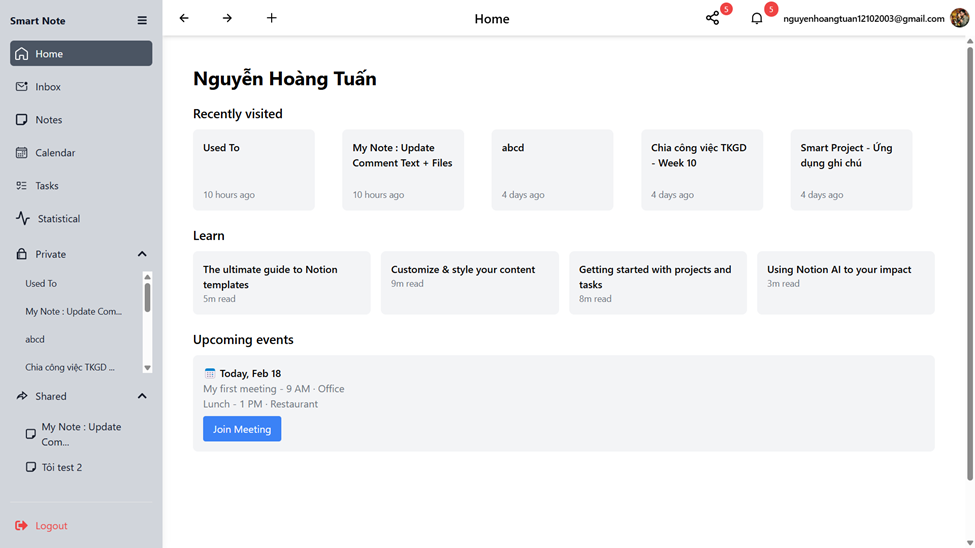
      <br />
      <em>Clean and intuitive dashboard</em>
    </td>
  </tr>
</table>

### Note Management
<table>
  <tr>
    <td align="center">
      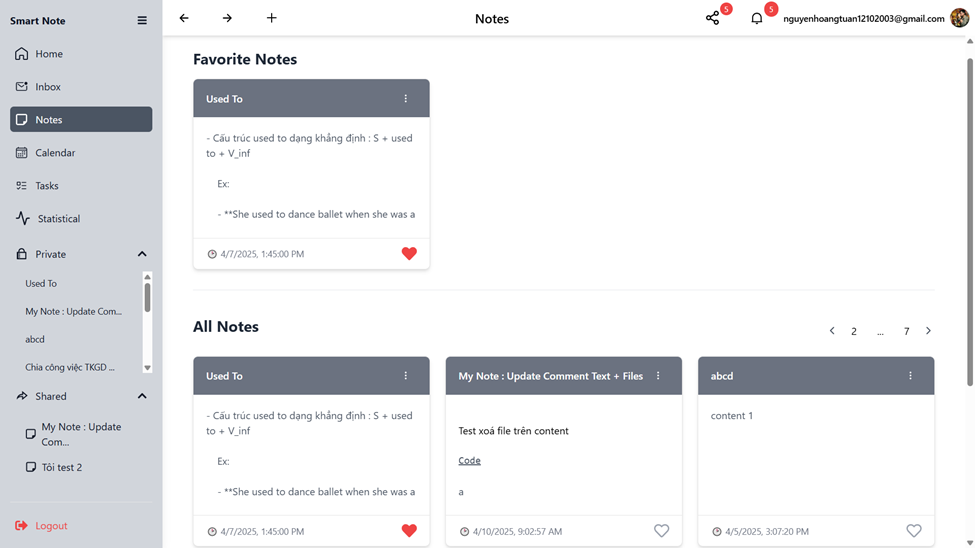
      <br />
      <em>Recent notes with upcoming deadline events</em>
    </td>
    <td align="center">
      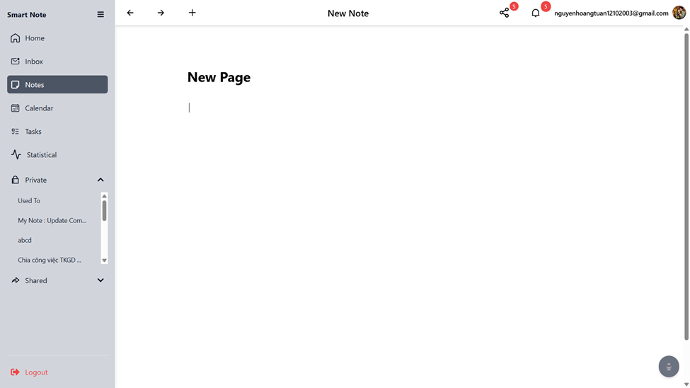
      <br />
      <em>Create new notes with rich text editor</em>
    </td>
  </tr>
  <tr>
    <td align="center">
      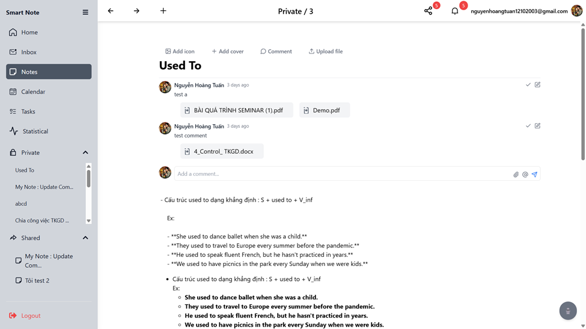
      <br />
      <em>Auto-save feature (every 5 seconds)</em>
    </td>
    <td align="center">
      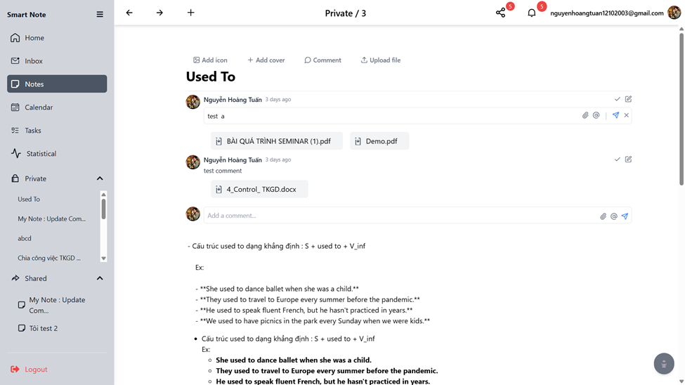
      <br />
      <em>Collaborative commenting system</em>
    </td>
  </tr>
</table>

### Calendar & Events
<table>
  <tr>
    <td align="center">
      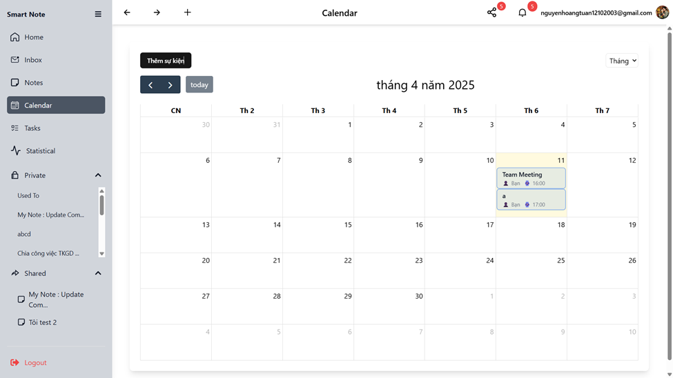
      <br />
      <em>Comprehensive calendar with all events</em>
    </td>
    <td align="center">
      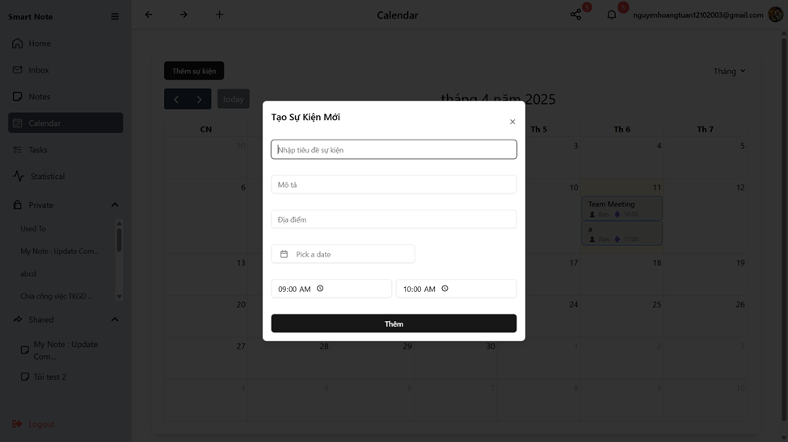
      <br />
      <em>Intuitive event creation interface</em>
    </td>
  </tr>
</table>

### Task Management
<table>
  <tr>
    <td align="center">
      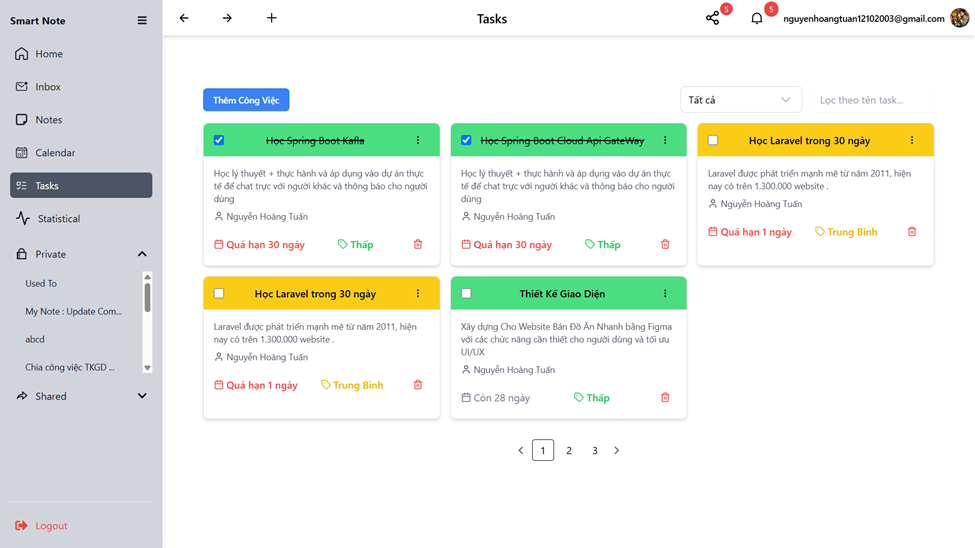
      <br />
      <em>Tasks sorted by priority and deadline</em>
    </td>
    <td align="center">
      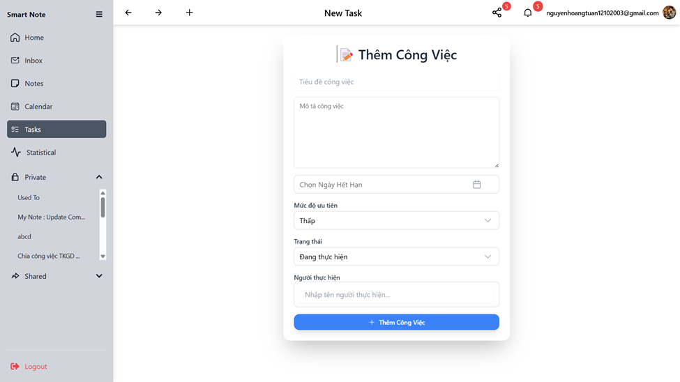
      <br />
      <em>Quick task creation with priority levels</em>
    </td>
  </tr>
</table>

### Collaboration Features
<table>
  <tr>
    <td align="center">
      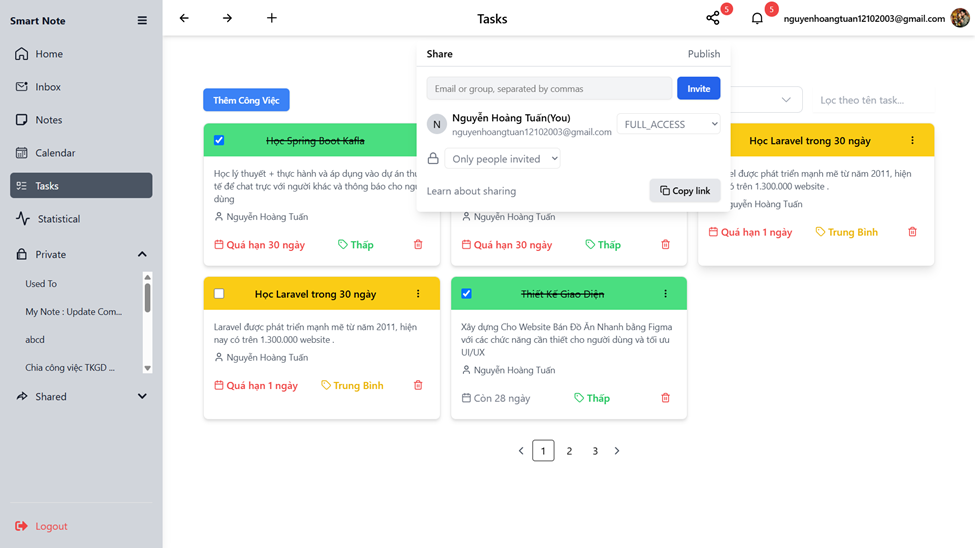
      <br />
      <em>Share notes via email invitation</em>
    </td>
    <td align="center">
      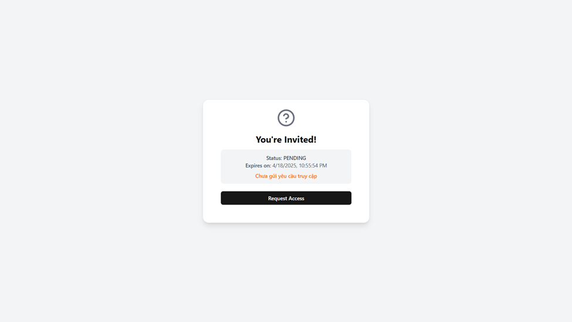
      <br />
      <em>Collaboration confirmation</em>
    </td>
  </tr>
  <tr>
    <td align="center">
      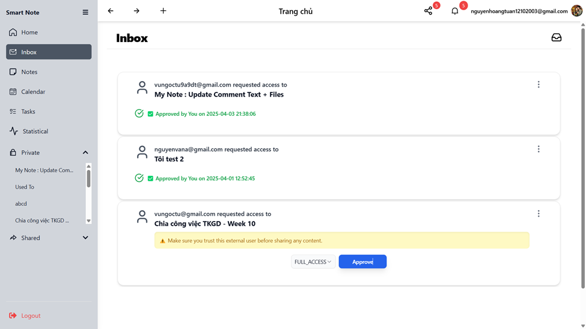
      <br />
      <em>Real-time invitation notifications</em>
    </td>
    <td align="center">
      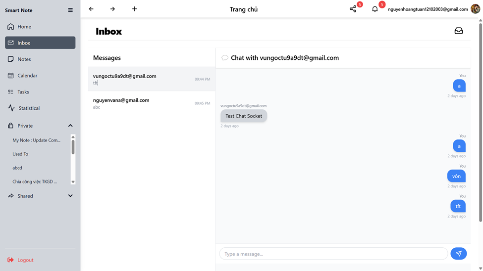
      <br />
      <em>Live chat with WebSocket support</em>
    </td>
  </tr>
</table>

### Notifications & Analytics
<table>
  <tr>
    <td align="center">
      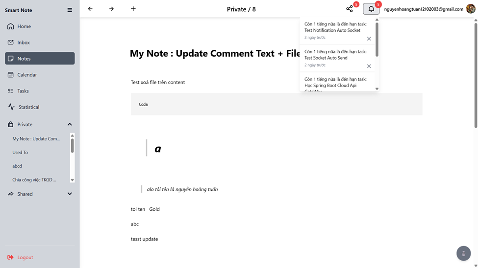
      <br />
      <em>Kafka + WebSocket notifications</em>
    </td>
    <td align="center">
      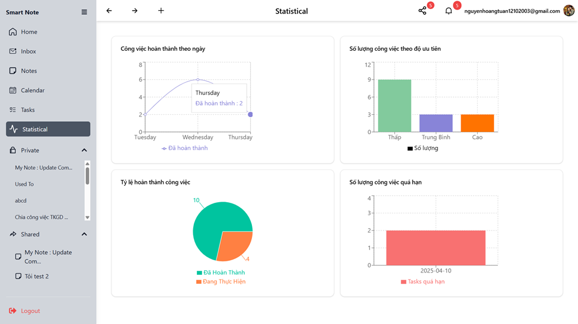
      <br />
      <em>Task statistics and analytics</em>
    </td>
  </tr>
</table>

## 🏗️ Technology Stack

### Backend
- **Framework**: Spring Boot 3.x
- **Language**: Java 17+
- **Database**: PostgreSQL
- **Messaging**: Apache Kafka
- **Real-time**: WebSocket (STOMP)
- **Security**: Spring Security + JWT
- **Build Tool**: Maven

### Frontend
- **Framework**: React 18+
- **Language**: TypeScript 5+
- **Build Tool**: Vite
- **UI Library**: [Your UI library, e.g., Material-UI, Ant Design]
- **State Management**: [Your state management, e.g., Redux, Zustand]
- **HTTP Client**: Axios
- **Real-time**: WebSocket Client

### DevOps
- **Containerization**: Docker & Docker Compose
- **Version Control**: Git & GitHub

## 🤝 Contributing

We welcome contributions! Please follow these steps:

1. **Fork the repository**
   ```bash
   git clone https://github.com/your-username/Project-SmartNote.git
   ```

2. **Create a feature branch**
   ```bash
   git checkout -b feature/amazing-feature
   ```

3. **Commit your changes**
   ```bash
   git commit -m "Add amazing feature"
   ```

4. **Push to your branch**
   ```bash
   git push origin feature/amazing-feature
   ```

5. **Open a Pull Request**

### Code Style Guidelines
- Follow Java coding conventions for backend code
- Use ESLint and Prettier for frontend code
- Write meaningful commit messages
- Add tests for new features
- Update documentation as needed

## 📝 License

This project is licensed under the MIT License - see the [LICENSE](LICENSE) file for details.

## 👨‍💻 Author

**Hoang Tuan**
- GitHub: [@hoangtuan203](https://github.com/hoangtuan203)
- Project Link: [https://github.com/hoangtuan203/Project-SmartNote](https://github.com/hoangtuan203/Project-SmartNote)

## 🙏 Acknowledgments

- Spring Boot community for excellent documentation
- React and TypeScript teams for amazing tools
- All contributors who help improve this project

---

<div align="center">
  Made with ❤️ by Hoang Tuan
  <br />
  <sub>If you find this project helpful, please consider giving it a ⭐️</sub>
</div>